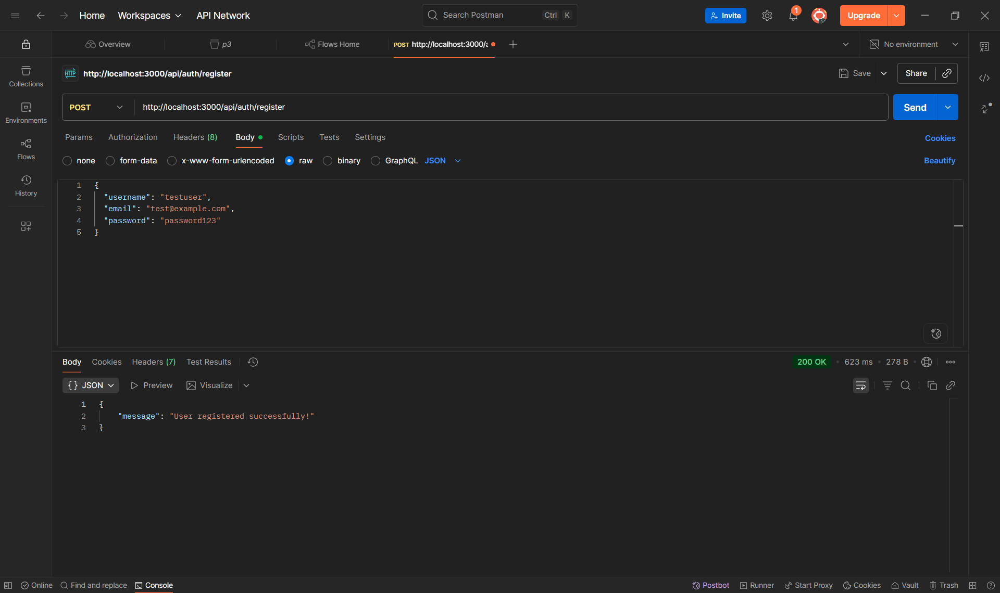
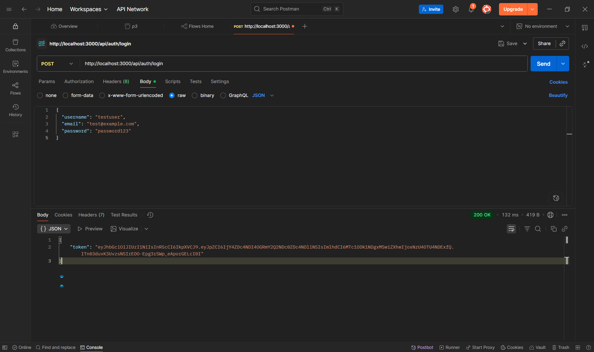
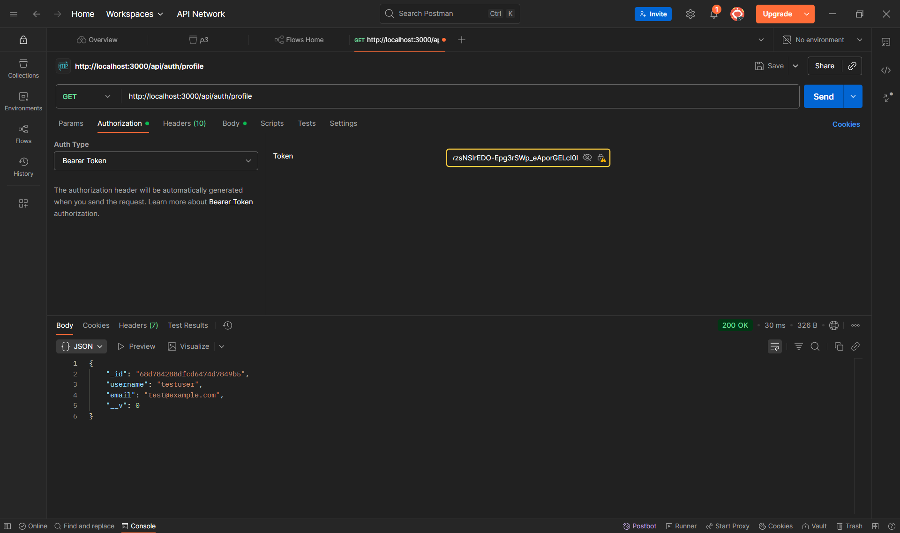
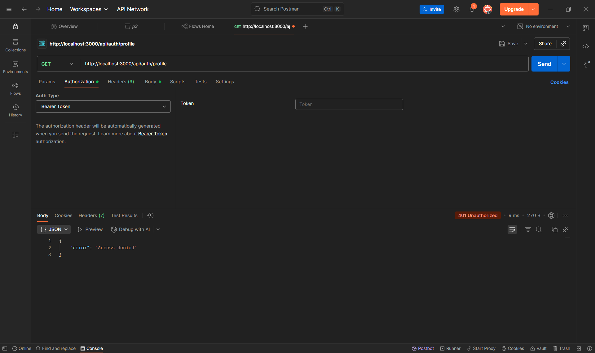
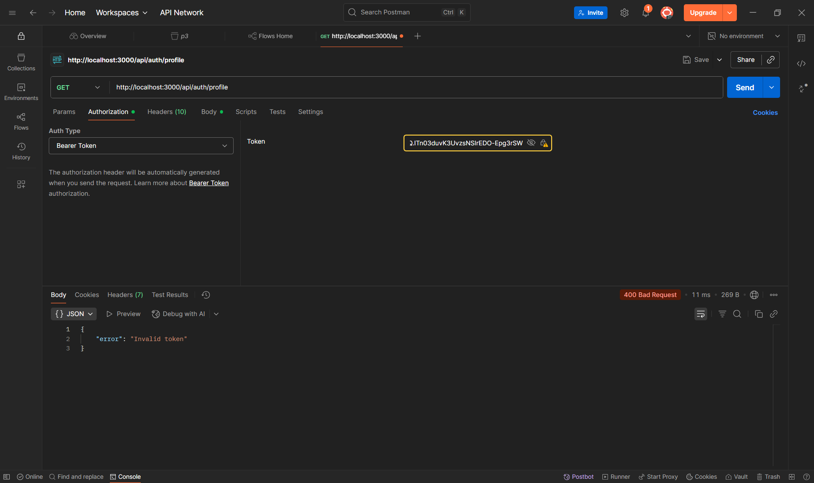
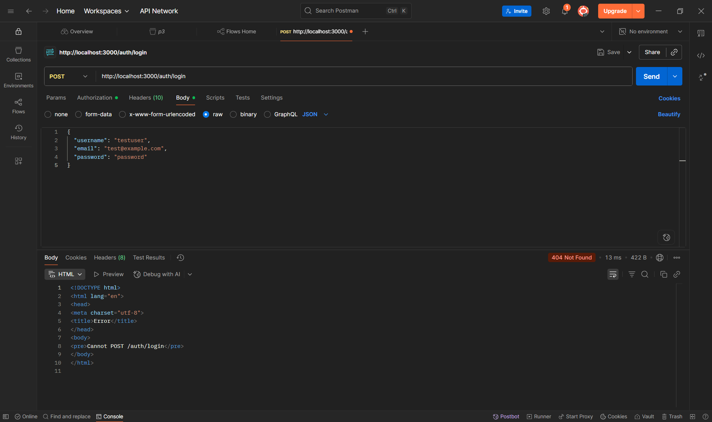

1. Đăng ký người dùng mới
Endpoint: POST http://localhost:3000/api/auth/register

2. Đăng nhập để nhận token
Endpoint: POST http://localhost:3000/api/auth/login

3. Truy cập thông tin profile (Protected Route)
Endpoint: GET http://localhost:3000/api/auth/profile

4. Thiếu token

5. Token không hợp lệ/hết hạn

6.  Sai thông tin đăng nhập

